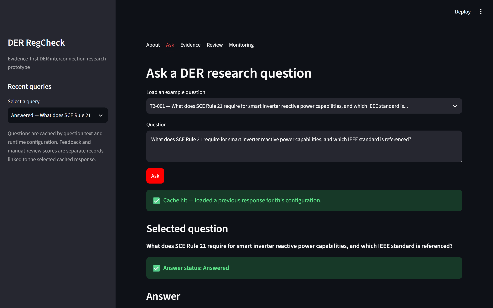
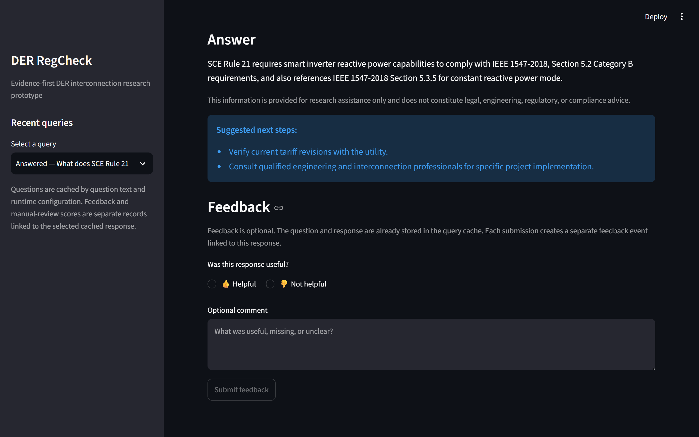
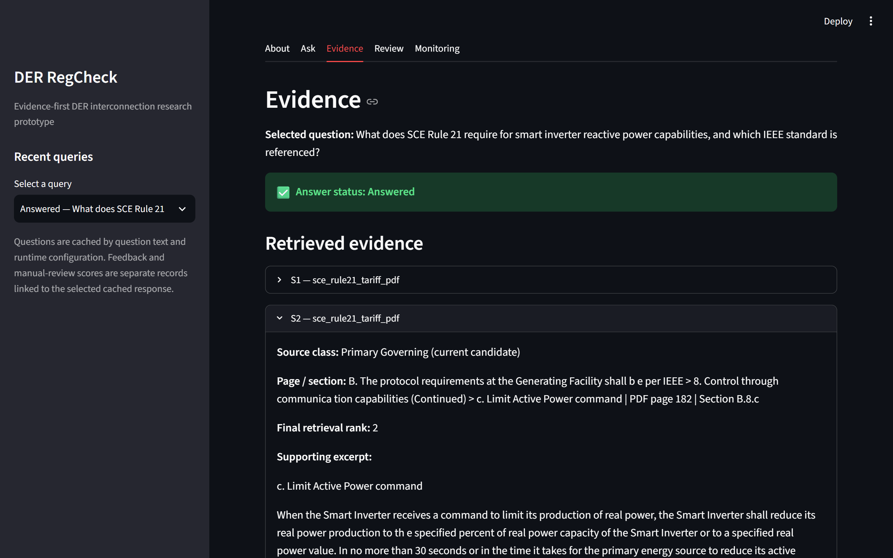
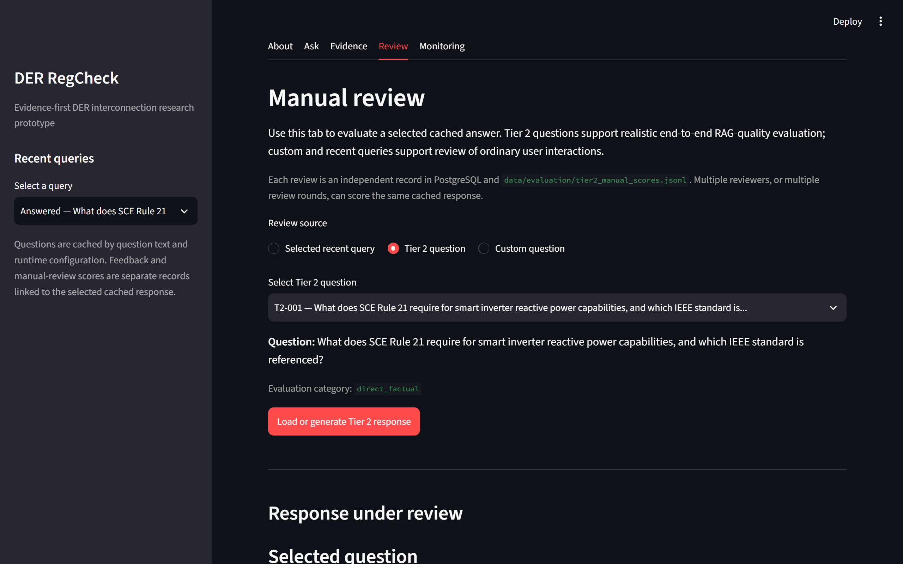
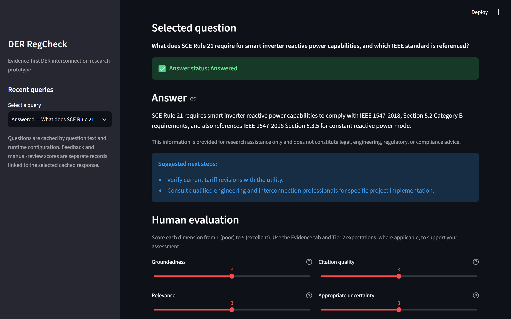
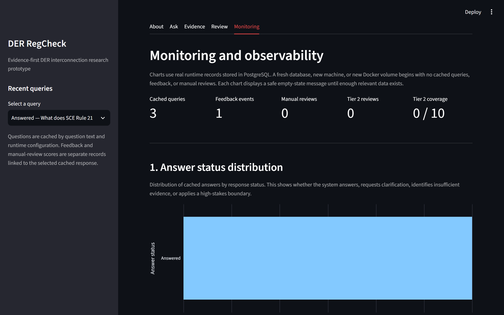

# DER RegCheck

DER RegCheck is an evidence-first retrieval-augmented generation (RAG) assistant for distributed energy resource (DER) interconnection and market-entry research. It helps analysts and project teams inspect governing tariff requirements, technical handbook detail, and supporting guidance from public California Rule 21 / Southern California Edison (SCE) documents.

It retrieves relevant passages from a curated corpus and generates structured answers with explicit citations, source hierarchy, and uncertainty. It supports human judgement; it does not provide legal, regulatory, engineering, or compliance advice.

> **Project status (v1)**
>
> - The deployed retrieval path uses pgvector vector retrieval plus local cross-encoder reranking (`BAAI/bge-reranker-base`).
> - The selected answer-generation prompt is `v3_few_shot_grounded_rag`, chosen under a 100% deterministic citation-validity guardrail.
> - The application includes a Streamlit interface (Ask, Evidence, Review, Monitoring), configuration-aware answer cache, feedback capture, and manual-review workflow.
> - Runtime telemetry and optional user feedback are stored in PostgreSQL tables: `query_cache`, `answer_feedback`, and `manual_scores`.
> - Retrieval and prompt configurations were evaluated on a 100-query synthetic benchmark, a 24-question prompt-evaluation set, and a 10-question RAG-impact evaluation.
> - The current benchmark is not a frozen held-out final benchmark.
> - Docker Compose is the canonical local runtime and ingestion path.
> - A temporary cloud deployment on AWS EC2 is available for peer review; see [Live demo](#live-demo) and [`docs/self-assessment.md`](docs/self-assessment.md).

---

## Reviewer Navigation

* **[Self-Assessment & Rubric Mapping](docs/self-assessment.md):** Start here for a direct map of project features to course evaluation criteria and the case for bonus/discretionary marks.
* **[Live Demo — AWS EC2](http://100.30.163.97:8501/):** Open the deployed Streamlit application for a five-minute review.
* **[Runbook](docs/runbook.md):** Complete steps for local reproduction and evaluation benchmark execution.

---

## Project overview

DER RegCheck is a research-support prototype for DER interconnection and market-entry questions over public California Rule 21 / SCE documents. It provides grounded, citation-validated answers, inspectable evidence, and a reviewer-friendly workflow (Ask, Evidence, Review, Monitoring) that can be run locally or via a temporary EC2 deployment.

---

## Rubric at a glance

This section summarises how DER RegCheck maps to the course rubric. For the full evidence trail and rationale, see [`docs/self-assessment.md`](docs/self-assessment.md).

| Criterion | Self-assessed score | What you'll see in this repo | Where to inspect |
|---|---:|---|---|
| **Problem description** | 2/2 | Clear DER interconnection / market-entry problem, users, scope, and retrieval rationale. | [Problem](#problem), [Scope](#scope), [`docs/dataset-notes.md`](docs/dataset-notes.md) |
| **Retrieval flow** | 2/2 | Knowledge base (PostgreSQL + pgvector) + LLM answer generation with citations and source hierarchy. | [Data Flow](#data-flow), `src/retrieval/`, `src/generation/` |
| **Retrieval evaluation** | 2/2 | Lexical, vector, hybrid, reranked, and query-rewrite retrieval evaluated; best backend selected. | [Retrieval Evaluation Summary](#retrieval-evaluation-summary), [`docs/evaluation-notes.md`](docs/evaluation-notes.md) |
| **LLM evaluation** | 2/2 | Three prompt configurations compared with deterministic citation validation + LLM judge; best prompt selected. | [`docs/evaluation-notes.md`](docs/evaluation-notes.md), `data/evaluation/` |
| **Interface** | 2/2 | Streamlit UI (Ask, Evidence, Review, Monitoring) deployed locally and on EC2. | [Live demo](#live-demo), `src/ui/` |
| **Ingestion pipeline** | 2/2 | Fully automated scripted ingestion via Docker Compose (no dedicated orchestrator required). | [`compose.yaml`](compose.yaml), `src/ingestion/`, `src/processing/` |
| **Monitoring** | 2/2 | PostgreSQL-backed feedback + seven live telemetry charts with safe empty states. | [Monitoring tab](#user-interface), `src/observability/` |
| **Containerization** | 2/2 | Complete runtime defined in Docker Compose (DB + app). | [`Dockerfile`](Dockerfile), [`compose.yaml`](compose.yaml) |
| **Reproducibility** | 2/2 | Clear instructions, accessible processed data, pinned dependencies, runbook, and Docker runtime. | [Local Reproduction](#local-reproduction--developer-rebuild), [`docs/runbook.md`](docs/runbook.md), `uv.lock` |
| **Bonus: Hybrid search** | +1 | Implemented and evaluated (lexical + vector via reciprocal rank fusion). | [`docs/evaluation-notes.md`](docs/evaluation-notes.md) |
| **Bonus: Document reranking** | +1 | Implemented, evaluated, and selected as default retrieval. | [`docs/evaluation-notes.md`](docs/evaluation-notes.md) |
| **Bonus: User query rewriting** | +1 | Implemented and evaluated; retained as experimental due to latency. | [`docs/evaluation-notes.md`](docs/evaluation-notes.md), [Decision 13](docs/decisions.md#13-runtime-configuration-disable-query-expansion-for-latency) |
| **Bonus: Cloud deployment** | +2 | Temporary EC2 deployment for peer-review demonstration. | [Live demo](#live-demo), [`docs/self-assessment.md`](docs/self-assessment.md) |

## Extra Bonus Points (Up to 3 additional marks)

Beyond the core rubric, DER RegCheck is designed to exceed baseline expectations in four areas: evaluation depth, safety/governance, reproducibility/engineering quality, and documentation. The self-assessment provides the full narrative; the bullets below summarise the key points a marker can verify quickly.

**1. Evaluation depth and rigour**

Large-scale retrieval benchmark (100 queries; 7,500 retrieval + 8,000 query-rewrite records) across lexical, vector, hybrid, and reranked backends, plus a two-tier design: Tier 1 retrieval metrics and Tier 2 RAG-quality scoring on 24 realistic questions. A separate four-condition RAG-impact evaluation on the 10-question Tier 2 set quantifies the contribution of retrieval and evidence grounding to answer quality. Every answer is checked with deterministic citation validation; prompts that produce any invalid citations are rejected regardless of LLM-judge score.

**2. Safety, governance, and responsible use**

Fail-closed citation guardrail (unknown/invalid citations → answer rejected), source hierarchy and content-hash tracking for chunks, and a Review tab that supports blinded, rubric-based scoring of Tier 2 questions for human oversight.

**3. Reproducibility and engineering quality**

End-to-end containerization via a single Docker Compose stack (used locally and on EC2), stateless application configuration, regression tests across core pipeline components, and pinned dependencies (`uv.lock`) with a step-by-step runbook.

**4. Documentation and assessment transparency**

Six dedicated documents (runbook, dataset notes, decisions, evaluation notes, project log, self-assessment), 20+ decision records with rationale and trade-offs, and committed JSONL/CSV evaluation artefacts that markers can inspect and re-run.

For the full narrative, examples, and links to specific artefacts, see the [Extra Bonus Points (case for additional marks)](docs/self-assessment.md#extra-bonus-points-case-for-additional-marks) section in the self-assessment.

---

## Interface at a glance

The screenshots below show the main reviewer workflow: submit a DER research question, inspect the generated answer, verify its evidence, optionally review it manually, and inspect stored runtime telemetry.

### Ask: question and answer state



> Ask tab: a Tier 2 DER question is submitted through the cache-aware workflow, with the selected question, cache state, and answer-status result visible.

### Ask: grounded answer and feedback



> Ask tab: the generated answer includes an uncertainty boundary, suggested next steps, and optional Helpful / Not helpful feedback linked to the cached response.

### Evidence: source hierarchy and locators



> Evidence tab: inspect retrieved chunks with source class, heading path, PDF page or section locator, retrieval rank, and preserved supporting excerpts.

### Review: manual evaluation workflow



> Review tab: select a Tier 2 question, load or generate its response, and evaluate groundedness, relevance, completeness, citation quality, and appropriate uncertainty.

### Review: answer scoring form



> Review tab: score the selected answer on the five 1–5 human-review dimensions while inspecting the answer and its research-support boundary.

### Monitoring: runtime telemetry



> Monitoring tab: PostgreSQL-backed runtime summary showing cached queries, feedback events, manual reviews, Tier 2 coverage, and answer-status distribution.

---

## Live demo

**[Open DER RegCheck on AWS EC2](http://100.30.163.97:8501/)**

The application is temporarily deployed on AWS EC2 for peer-review access. It runs the same Docker Compose stack documented for local reproduction.

The deployment is a demonstration environment rather than a production service. It does not include HTTPS, a custom domain, managed secrets, backups, high availability, or production monitoring. It will be decommissioned after the review period.

---

## Review in five minutes

You do not need to clone the repository to review the main application workflow.

1.  Open the **[live EC2 demo](http://100.30.163.97:8501/)**.
2.  Select **Ask**.
3.  Choose a Tier 2 example question or paste a short DER research question, for example:

    ```text
    What does SCE Rule 21 require for smart inverter reactive power?
    ```

4.  Select **Submit**.
5.  Confirm that the interface shows:
    - A generated answer with inline citation labels.
    - An explicit uncertainty or clarification note where appropriate.
    - Expandable evidence cards with source class (e.g., primary tariff vs technical handbook), heading path, and page/section locators.
    - Feedback controls (Helpful / Not helpful).
6.  Open **Monitoring** to inspect seven live telemetry charts—answer-status distribution, feedback distribution, average manual-review scores, cache-miss latency over time, cache-miss latency by answer status, query volume over time, and Tier 2 manual-review coverage.
7.  Optionally open **Review** to inspect the Tier 2 manual-review workflow and scoring rubric.

The Ask workflow uses the selected v3 path:

```text
User question
        ↓
Vector retrieval of top candidates (pgvector)
        ↓
Local cross-encoder reranking (BAAI/bge-reranker-base)
        ↓
Top 10 chunks used as answer context
        ↓
Structured answer using v3_few_shot_grounded_rag with deterministic citation validation
```

---

## Assessment evidence

| Criterion | Evidence |
|---|---|
| Problem and scope | [Problem](#problem), [Scope](#scope), [`docs/dataset-notes.md`](docs/dataset-notes.md) |
| Knowledge base plus LLM flow | [Data Flow](#data-flow), `src/retrieval/`, `src/generation/` |
| Retrieval evaluation | [Retrieval Evaluation Summary](#retrieval-evaluation-summary), [`docs/evaluation-notes.md`](docs/evaluation-notes.md) |
| LLM evaluation | [`docs/evaluation-notes.md`](docs/evaluation-notes.md), `data/evaluation/` |
| Interface | [Live EC2 demo](http://100.30.163.97:8501/), `src/ui/` |
| Automated ingestion | [`compose.yaml`](compose.yaml), `src/ingestion/`, `src/processing/`, `src/database/` |
| Monitoring | `src/ui/streamlit_app.py` (Monitoring tab), `src/observability/` |
| Containerization | [`Dockerfile`](Dockerfile), [`compose.yaml`](compose.yaml) |
| Reproducibility | [Local Reproduction](#local-reproduction--developer-rebuild), [`docs/runbook.md`](docs/runbook.md), `uv.lock` |
| Self-assessment | [`docs/self-assessment.md`](docs/self-assessment.md) |

---

## Problem

Teams researching DER products, projects, or market opportunities must locate, read, compare, and interpret a fragmented set of public documents: regulator overviews, utility tariffs, interconnection handbooks, testing/certification instructions, web guidance, and historical working-group reports. Doing this manually is slow and inconsistent because relevant provisions are scattered, conditional, and version-sensitive.

**DER RegCheck** solves this by providing a retrieval-augmented assistant over a curated California Rule 21 / SCE corpus. Rather than relying on a general LLM's ungrounded advice, it semantically searches a curated corpus, retrieves the most relevant passages, and generates a structured answer. It explicitly surfaces supporting evidence, source hierarchy, and uncertainty, keeping the human analyst in the loop while reducing manual search time.

---

## Scope

Version 1 focuses on a narrow DER interconnection and market-entry research task: given a research question, retrieve relevant tariff, handbook, and supporting material, then generate a citation-validated summary for analyst review.

### Included

- Six public CPUC and SCE sources (tariff, handbook, testing instruction, web guidance, overview, historical SIWG Phase 2)
- Processed corpus: extracted text, normalised evidence blocks, searchable chunks, and Nomic embeddings
- PostgreSQL with pgvector for chunk records and embeddings
- Vector retrieval plus local cross-encoder reranking
- Structured answer generation with deterministic citation validation
- Streamlit Ask, Evidence, Review, and Monitoring interfaces
- User feedback capture and manual-review workflow
- Automated Docker Compose ingestion and runtime
- Public Tier 2 example questions in the Ask tab

### Out of scope

- Legal, regulatory, engineering, or compliance advice
- Multi-utility or multi-market coverage (v1 is SCE / Rule 21 only)
- Live tariff or handbook version monitoring beyond content-hash tracking
- Production hardening (HTTPS, custom domain, managed secrets, backups, HA)
- Public exposure of raw source PDFs/HTML (only processed derivatives are committed)

---

## Local Reproduction & Developer Rebuild

For full environment setup, database initialization, containerized execution, LLM configuration, and targeted rebuilds, please refer to the **[Runbook](docs/runbook.md)**.

---

## Data Flow

The project uses public CPUC and SCE documents. For extraction rules, schema details, and the full pipeline flow, please refer to the **[Dataset Notes](docs/dataset-notes.md)**.

---

## Retrieval Evaluation Summary

The selected v1 configuration utilizes vector retrieval plus local cross-encoder reranking. This approach outperformed lexical, plain vector, and hybrid alternatives on the current benchmark and is therefore the default downstream retrieval path. Query expansion improved metrics slightly but introduced unacceptable latency for interactive use and is retained as an evaluated experimental capability. For the complete benchmark methodology, detailed metric tables, and latency trade-offs, see the **[Evaluation Notes](docs/evaluation-notes.md)**.

The current retrieval and answer-generation results were produced using a 100-query synthetic benchmark and a 24-question prompt-evaluation set. The benchmark is not frozen; reviewers can regenerate queries or extend the set following the workflow in [`docs/evaluation-notes.md`](docs/evaluation-notes.md).

---

## Current implementation

### Completed

- Download and provenance tracking for six public CPUC and SCE sources.
- Page-preserving PDF text extraction and main-content HTML extraction.
- Deterministic evidence normalisation with source-specific rules and tariff-specific parser.
- Structural chunking with citation metadata, neighbour links, and oversized-block flagging.
- Embedding generation using Nomic `nomic-embed-text-v1.5` (768-dim vectors).
- PostgreSQL + pgvector database initialisation.
- Chunk and embedding loading scripts and audit records.
- Lexical, vector, hybrid, and reranked retrieval evaluation (7,500 retrieval records).
- Query-rewrite evaluation (original, expanded, HyDE, HyDE-expanded) with 8,000 records.
- Deterministic citation validation for every generated answer.
- LLM-as-judge evaluation of three prompt configurations on 24 questions.
- Prompt-selection decision: `v3_few_shot_grounded_rag` selected under 100% citation-validity guardrail.
- RAG-impact evaluation: four-condition study (naive model-only, no-evidence v3, zero-shot RAG, full v3 RAG) on 10 Tier 2 questions with blinded pairwise judging.
- Streamlit analyst-facing UI and monitoring dashboard with seven charts.
- PostgreSQL-backed runtime telemetry and optional user-feedback persistence using `query_cache`, `answer_feedback`, and `manual_scores`.
- Immediate query-event logging after successful answer generation, independent of optional feedback submission.
- Application Dockerfile and Compose configuration for PostgreSQL and Streamlit.
- Committed evaluation artefacts for marker inspection.

### Planned

- Optional future work (beyond v1 assessment scope):
  - Expand evaluation with more diverse or human-authored questions while preserving a held-out test set.
  - Collect sufficient Tier 2 manual reviews to produce stable aggregate human-review results.
  - Investigate source-aware filtering and tier-based retrieval constraints.
  - Production hardening beyond the current temporary EC2 demonstration deployment.

---

## User interface

The project includes a Streamlit-based analyst-facing UI and monitoring dashboard.

### Tabs

- **About**: Overview, data sources, and responsible-use boundary.
- **Ask**: DER research question input, retrieval with reranking, structured answer generation, evidence inspection, and feedback capture.
- **Evidence**: Expandable evidence cards with source class, heading path, and page/section locators.
- **Review**: Tier 2 realistic RAG-quality manual-review workflow with 1–5 scoring on five dimensions.
- **Monitoring**: PostgreSQL-backed runtime telemetry dashboard with seven operational views.

---

## Repository structure

_Representative structure (simplified and alphabetically ordered):_

```text
der-regcheck/
├── compose.yaml                  # Docker Compose runtime (PostgreSQL, Streamlit)
├── config/                       # Normalisation and chunking configuration
├── data/                         # Processed corpus and evaluation inputs/outputs
│   ├── corpus/                   # Raw source downloads (local, not committed)
│   ├── evaluation/               # Queries, results, summaries, LLM evaluation artefacts
│   ├── processed/                # Extracted, normalised, chunked, embedded artefacts (committed)
│   └── corpus_metadata.json      # Source provenance and eligibility metadata
├── docs/                         # Documentation and assessment artefacts
│   ├── decisions.md              # Architecture and evaluation decisions
│   ├── dataset-notes.md          # Corpus scope, provenance, schema, and processing rules
│   ├── evaluation-notes.md       # Benchmark design, metrics, retrieval results, and answer evaluation
│   ├── project-log.md            # Chronological progress, discoveries, and immediate next steps
│   ├── runbook.md                # Local reproduction, commands, and troubleshooting
│   └── self-assessment.md        # Criterion-by-criterion self-assessment
├── pyproject.toml                # Python project metadata and dependencies
├── README.md                     # Project overview and assessment evidence map
├── src/                          # Python source code
│   ├── database/                 # PostgreSQL + pgvector initialisation
│   ├── evaluation/               # Retrieval benchmarks, LLM-as-judge, and manual review
│   ├── generation/               # Answer-generation prompts, citation validation, and orchestration
│   ├── ingestion/                # Source download and extraction scripts
│   ├── observability/            # Query cache, feedback, and manual-score persistence
│   ├── processing/               # Normalisation, chunking, embedding, and quality checks
│   ├── retrieval/                # Embedding, lexical, vector, hybrid, reranking, and query expansion
│   └── ui/                       # Streamlit application
├── tests/                        # Regression tests for pipeline and evaluation components
├── uv.lock                       # Locked Python dependency versions
└── .env.example                  # Example environment configuration
```

---

## Documentation

| Document | Purpose |
|---|---|
| [`docs/runbook.md`](docs/runbook.md) | Setup, pipeline commands, verification, rebuilds, benchmarks, answer-generation, UI, and troubleshooting |
| [`docs/dataset-notes.md`](docs/dataset-notes.md) | Corpus scope, provenance, schema, processing rules, artefact policy, and limitations |
| [`docs/decisions.md`](docs/decisions.md) | Stable architecture, corpus, retrieval, and evaluation decisions |
| [`docs/evaluation-notes.md`](docs/evaluation-notes.md) | Benchmark design, metrics, retrieval results, answer evaluation, and limitations |
| [`docs/project-log.md`](docs/project-log.md) | Chronological progress, discoveries, and immediate next steps |
| [`docs/self-assessment.md`](docs/self-assessment.md) | Criterion-by-criterion self-assessment and case for bonus/discretionary marks |

---

## Limitations

- The v1 corpus covers California Rule 21 and SCE only; it is not yet multi-utility or multi-market.
- Sources can change at their original URLs; corpus hashes and review procedures mitigate but do not eliminate currency risk.
- Some PDF extraction artifacts remain in citation-grade evidence text.
- Relevance labels are metadata-derived rather than manually judged semantic relevance.
- The benchmark queries are synthetic and may not represent real user-query distributions.
- Query expansion is implemented but not part of the default interactive path due to latency.
- Tier 2 aggregate human-review results are not yet stable until sufficient manual scores have been collected.
- The local deployment and EC2 instance are research prototypes without production hardening (HTTPS, custom domain, managed secrets, backups, or high availability). The EC2 deployment is temporary and will be decommissioned after the review period.

---

## Responsible use

DER RegCheck is a research-support prototype. It does not provide legal, regulatory, engineering, or compliance advice. Users should verify important conclusions against the current authoritative source, check applicability conditions, distinguish historical material from current requirements, and consult qualified professionals where appropriate.